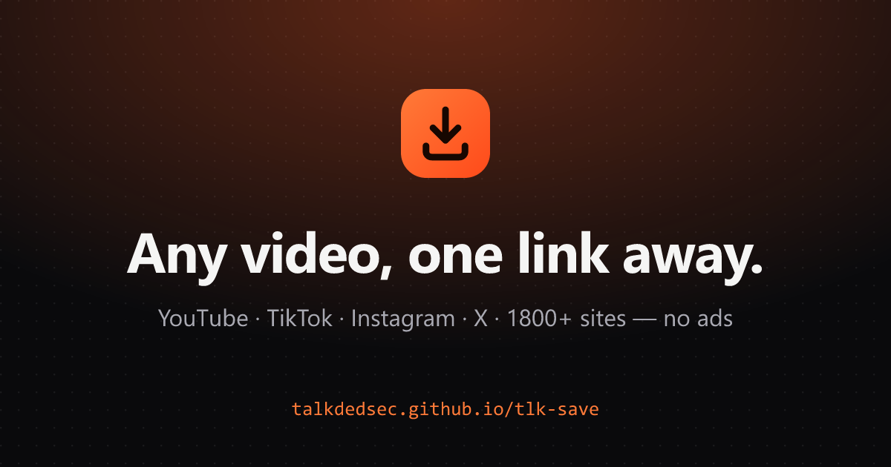

<p align="center">
  
</p>

<p align="center">
  <a href="https://talkdedsec.github.io/tlk-save/"><b>talkdedsec.github.io/tlk-save</b></a>
  ·
  <a href="README.md">English</a>
</p>

# tlk-save

YouTube, TikTok, Instagram, X ve 1800'den fazla siteden video ve ses indir. Linki yapıştır, kaliteyi seç, bitti. Reklam, hesap ya da takip yok.

- **Gerçek en yüksek kalite**: Sitede varsa 4K, 60 fps ve HDR. Her oynatıcıda açılan MP4 olarak birleştirilir.
- **MP3 / M4A**: Kapak görseli, başlık ve sanatçı bilgisi dosyanın içine gömülü gelir.
- **Klip, altyazı, kapak**: Videonun sadece bir bölümünü, altyazısını SRT olarak ya da kapak görselini tam çözünürlükte indirebilirsin.
- **Her yerden**: Telefonda doğrudan Paylaş menüsünden (sayfayı ana ekrana ekle), bilgisayarda tek tıklık yer imi butonuyla.
- **Gizli**: Dosyalar hazır olduktan 30 dakika sonra sunucudan silinir. Ne indirdiğin kaydedilmez. Son indirilenler listesi sadece senin tarayıcında durur.
- Türkçe ve İngilizce, açık ve koyu tema, her ekran boyutunda çalışır.

## Nasıl çalışıyor

```
tarayıcı ──▶ talkdedsec.github.io/tlk-save   (statik site, bu reponun web/ klasörü)
    │
    └──────▶ tlk-save sunucusu                (bu reponun server/ klasörü, Rust)
                  └─ yt-dlp + ffmpeg          (bulur, indirir, birleştirir, dönüştürür)
```

Tarayıcıların bu sitelerden doğrudan video çekmesine izin verilmiyor, bu yüzden işi küçük bir sunucu yapıyor. Sunucu, bağımsız [yt-dlp](https://github.com/yt-dlp/yt-dlp) programını çalıştıran tek bir Rust programı. İlerlemeyi canlı olarak sayfaya gönderir ve biten dosyayı teslim eder. Genel çıkarıcı kapalı olduğu için sunucu sadece yt-dlp'nin tanıdığı siteleri açar, iç ağdaki adreslere yönlendirilemez.

## Kendi sunucunu çalıştır

**Windows Server** (Caddy ile otomatik HTTPS, Windows ile birlikte başlar, çökerse yeniden açılır). Yönetici olarak açılmış PowerShell'de:

```powershell
irm https://raw.githubusercontent.com/Talkdedsec/tlk-save/main/server/deploy/windows/install.ps1 | iex
```

**Linux / Docker**:

```bash
docker build -t tlk-save server
docker run -d --restart unless-stopped -p 127.0.0.1:8787:8787 -e TLK_SAVE_ORIGINS=https://site.adresin tlk-save
```

**Kendi bilgisayarında**: [Releases](https://github.com/Talkdedsec/tlk-save/releases) sayfasından `tlk-save`'i indir, `yt-dlp` ve `ffmpeg`'i yanına ya da `PATH`'e koy ve çalıştır. Sonra siteyi aç, en alttaki **Sunucu** bağlantısına tıkla ve `http://127.0.0.1:8787` yaz.

Ayarların ve API'nin tam listesi [İngilizce README](README.md#settings)'de.

## Geliştirme

```bash
cd server && cargo run            # API: 127.0.0.1:8787
cd web && npm install && npm run dev   # site: localhost:5173, yerel API'ye bağlanır
```

Testler: `server/` içinde `cargo test`, `web/` içinde `npm test`.

## Sorumlu kullan

Kendi videolarını, izin aldığın ya da telif hakkı olmayan içeriği indir. İndirdiğin dosyalarla ne yaptığın senin sorumluluğunda.

## Lisans

[MIT](LICENSE). yt-dlp Unlicense ile yayınlanıyor. Kurulum scriptlerinin kullandığı ffmpeg derlemeleri GPL lisanslı.
